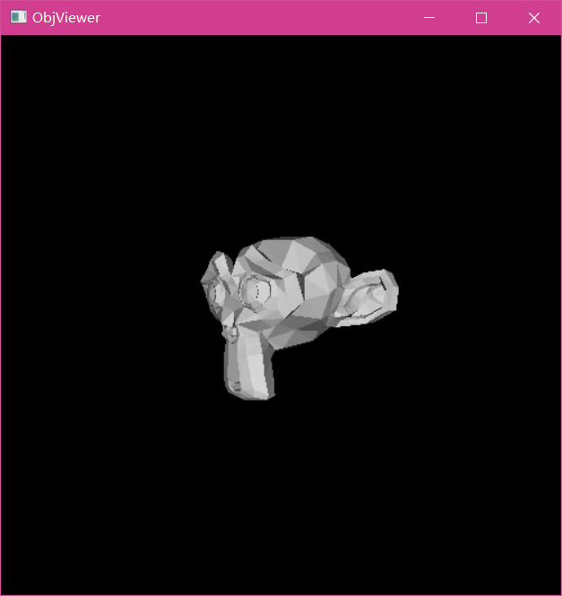

### Obj file loader and visualizer

This is an opengl version of ObjLoader. Compared to our baseline, we speed up the process by utilizing glmath library and redueced the code at the same time.

**Requirement**

- glfw
- freeglut
- glm
- VS Studio 2015+

bs. you may need to reconfigure the lib path if you want to compile it

**Result**

